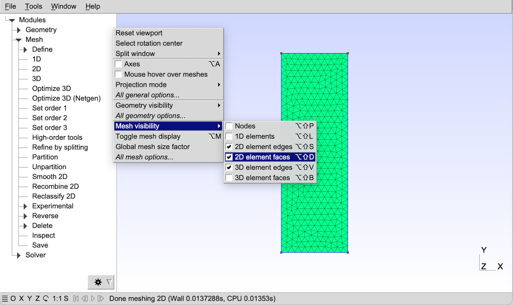

# Gmsh图形用户界面

只要你安装了Gmsh软件（参见[在你的计算机上安装和允许Gmsh](https://gmsh.info/doc/texinfo/gmsh.html#Installing-and-running-Gmsh-on-your-computer)），你只需双击Gmsh的图标或者在终端的提示符下输入如下命令就能启动图形界面:

> gmsh

这将会打开Gmsh GUI的主窗口，菜单栏在顶上（除了MacOS，默认情况下它的菜单栏在屏幕顶上——可以通过设置General.SystemMenuBar选项来改变，参见[常规选项](https://gmsh.info/doc/texinfo/gmsh.html#General-options)），树形菜单在左边（默认情况下，包含一个”模块(Module)“入口和三个子项：“几何(Geometry)”，”网格(mesh)“和”求解器(solver)“），图形区域在右边，状态栏和一些快捷按钮在底部。（你可以使用”窗口(Window) -> 附加/分离菜单(Attach/Detach Menu)“分离树形菜单。）


要创建一个新的几何模型，用"文件(File) -> 新建(New)"菜单来创建一个新的模型文件，并且选择例如mymodel.geo作为文件名字。在树形菜单中，依次打开”几何(Geometry)“，”基本实体(Elementary entities)“和”添加（Add）“子菜单，并且点击例如”矩形(Rectangle)“。一个带有参数的上下文窗口将会弹出：您可以在此窗口中输入一些参数（例如矩形的宽度和高度），然后移动鼠标将其放置在画布上。如果不想用鼠标放置矩形，请在窗口中选择“X”、“Y”和“Z 冻结”，然后在上下文窗口中手动输入坐标。完成后，按 e（查看图形窗口顶部的状态消息）或单击上下文窗口中的“添加”按钮。


无需保存您的几何模型：添加矩形时，脚本命令会自动附加到您的模型文件 mymodel.geo：

```GmshScriptingLanguage
//+
SetFactory("OpenCASCADE");
Rectangle(1) = {0, 0, 0, 1, 0.5, 0};
```

 您可以使用任何文本编辑器编辑该脚本；点击树形菜单中“编辑脚本(Edit script)”将启动由General.Editor选项指定的默认文本编辑器（参见[常规选项](https://gmsh.info/doc/texinfo/gmsh.html#General-options)）。如果您编辑脚本，则应单击“重新加载脚本(Reload script)”以在GUI中重新加载修改。脚本中的”//+“是注释，用作GUI添加添加的命令之间的标记；有关脚本语言的参考，请参见[Gmsh脚本语言](./gmsh_scripting_language.md)。

将GUI操作与脚本文件编辑相结合是使用Gmsh应用程序的经典方式。例如，直接在脚本中定义变量和点，然后用GUI交互地定义曲线、表面和体积通常更快。

要加载现有模型而非从头开始创建模型，请使用“文件 -> 打开”菜单。例如，要打开第一篇教程（参见[Gmsh教程](./gmsh_tutorial.md)），选择[t1.geo]([tutorials/t1.geo · gmsh_4_13_1 · gmsh / gmsh · GitLab](https://gitlab.onelab.info/gmsh/gmsh/blob/gmsh_4_13_1/tutorials/t1.geo))。在终端中，您也可以直接在命令行上指定文件名，即：

> gmsh t1.geo

要生成网格，请在树形菜单中打开“网格(Mesh)“并选择所需维度：”1D“将对所有曲线进行网格划分；”2D“将对所有表面进行网格划分（如果之前未调用“1D”，则为所有曲线）；”3D“将对所有体积进行网格划分（若之前未调用”2D“，则为所有表面）。要以当前网格格式保存生成的网格，请单击树形菜单中的“保存(Save)”，或使用”文件(File) -> 导出(Export)“菜单选择适当的格式和文件名（来进行导出）。默认的网格文件名是基于当前活动模型的名称，并根据网格格式附加拓展名。请注意，大多数交互式命令都有键盘快捷键：参见[键盘快捷键](https://gmsh.info/doc/texinfo/gmsh.html#Keyboard-shortcuts)，或在菜单中选择”帮助(Help) -> 键盘和鼠标使用(Keyboard and Mouse Usage)“。例如，要快速生成2D网格并且保存网格，您可以线按”2“，然后再按”Ctrl + Shift + s“。

双击图形窗口将会弹出快捷菜单，可用于快速切换网格实体（如表面）的可见性、重置窗口、选择旋转中心、显示轴或访问完整模块选项（从”工具(Tools) -> 选项(Options)”菜单中）。状态栏左下方的快捷键可用于快速调整视口：“X”，“Y”，“Z”将视口设置为与图形平面垂直的相应轴；旋转按钮将视图旋转90度；“1：1”重置比例。



可以同时加载多个文件。在命令行中指定时，第一个文件定义活动类型（与使用“文件(File) -> 打开(Open)“菜单的方式相同），其他文件将”合并“到该模型中（与使用”文件(File) -> 合并(Merge)“菜单的方式相同）。例如，要将[view1.pos](https://gitlab.onelab.info/gmsh/gmsh/blob/gmsh_4_13_1/tutorials/view1.pos)和[view5.msh](https://gitlab.onelab.info/gmsh/gmsh/blob/gmsh_4_13_1/tutorials/view5.msh)中包含的后处理视图与第一个教程中的几何图形合并，可以键入如下命令：

> gmsh t1.geo view1.pos view5.msh

加载一个或多个后处理视图后，树形菜单中会出现”后处理“条目。使用上一个命令，树形菜单中的”后处理(Post-processing)“下会出现三个视图，分别标记为”标量图(A scalar map)“、“节点标量图(Nodal scalar map)”和“元素1矢量(Element 1 vector)”。在此示例中，视图包含多个时间步骤：您可以使用状态栏左侧的快捷方式图标循环浏览它们。用鼠标单击视图名称将切换所选视图的可见性，而单击右侧的箭头按钮将访问视图的选项。

请注意，所有以交互方式指定的选项也可以直接在脚本文件中指定。您可以使用“文件(File) -> 保存模型选项(Save Model)”保存当前活动模型的当前选项。这将创建一个新的选项文件，其文件名与活动模型相同，但会添加额外的 .opt 扩展名。下次打开此模型时，相关选项也将自动加载。要将当前选项保存为所有未来 Gmsh 会话的默认首选项，请改用“文件(File) -> 将选项另存为默认(Save Options as Default)”菜单。您还可以通过在“文件(File) -> 导出(Export)”中选择“Gmsh 选项”格式将当前选项保存在任意文件中。有关可用选项的更多信息（以及如何将它们重置为默认值），请参阅[Gmsh 选项](./gmsh_options.md)。还可以使用“帮助->当前选项”菜单获取选项及其当前值的完整列表。

最后，注意GUI也可以通过使用API唤起运行（和修改）：要获取更多细节，请参见[命名空间 gmsh/fltk]([Gmsh 4.13.1](https://gmsh.info/doc/texinfo/gmsh.html#Namespace-gmsh_002ffltk))。

接下来的两个章节阐述GUI中的鼠标操作，以及所有的预设的键盘快捷键。解释如何使用Gmsh GUI的录屏视频可以在如下网址获取到：[录屏视频](https://gmsh.info/screencasts/)。

- 鼠标操作

- 键盘快捷键


## 3.1 鼠标操作

- 移动(move)

> 突出显示鼠标指针下的实体并显示其属性/调整套索缩放或套索（取消）选择的大小

- 左键(left button)

> 旋转/旋转实体/接受套索缩放或套索选择。

- Ctrl + 左键(left button)

> 开始套索缩放或套索（取消）选择

- Ctrl + 中键(middle button)

> 正交化展示

- 右键(right button)

> 平移/取消套索缩放或套索（取消）选择/后处理视图按钮上的弹出菜单

- Ctrl + 右键(right button)

> 重置到默认视口

对于两按键鼠标，中键 = Shift + 左键

对于一按键鼠标，中键 = Shift + 左键，右键 = Alt + 左键


## 3.2 键盘快捷键


