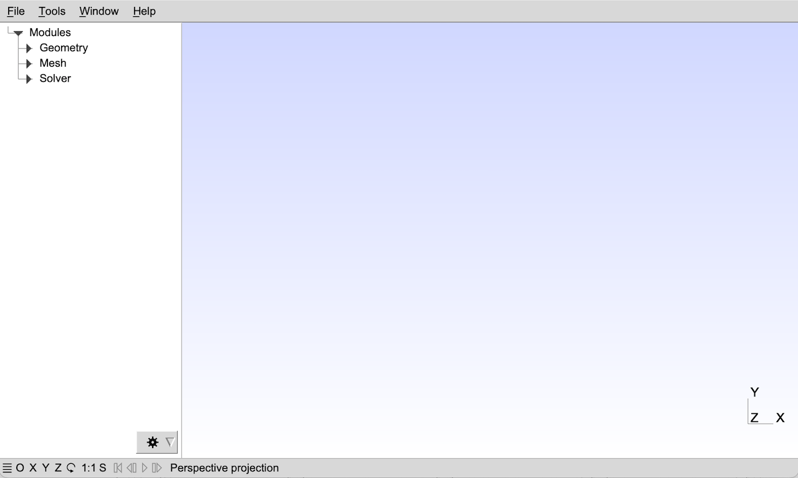
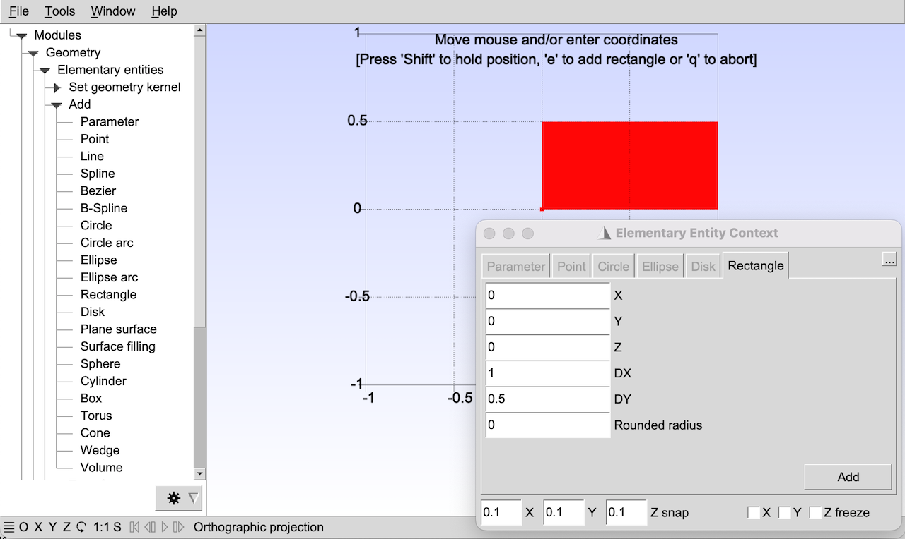

# Gmsh图形用户界面

只要你安装了Gmsh软件（参见[在你的计算机上安装和允许Gmsh](https://gmsh.info/doc/texinfo/gmsh.html#Installing-and-running-Gmsh-on-your-computer)），你只需双击Gmsh的图标或者在终端的提示符下输入如下命令就能启动图形界面:

> gmsh

这将会打开Gmsh GUI的主窗口，菜单栏在顶上（除了MacOS，默认情况下它的菜单栏在屏幕顶上——可以通过设置General.SystemMenuBar选项来改变，参见[常规选项](https://gmsh.info/doc/texinfo/gmsh.html#General-options)），树形菜单在左边（默认情况下，包含一个”模块(Module)“入口和三个子项：“几何(Geometry)”，”网格(mesh)“和”求解器(solver)“），图形区域在右边，状态栏和一些快捷按钮在底部。（你可以使用”窗口(Window) -> 附加/分离菜单(Attach/Detach Menu)“分离树形菜单。）



要创建一个新的几何模型，用"文件(File) -> 新建(New)"菜单来创建一个新的模型文件，并且选择例如mymodel.geo作为文件名字。在树形菜单中，依次打开”几何(Geometry)“，”基本实体(Elementary entities)“和”添加（Add）“子菜单，并且点击例如”矩形(Rectangle)“。一个带有参数的上下文窗口将会弹出：您可以在此窗口中输入一些参数（例如矩形的宽度和高度），然后移动鼠标将其放置在画布上。如果不想用鼠标放置矩形，请在窗口中选择“X”、“Y”和“Z 冻结”，然后在上下文窗口中手动输入坐标。完成后，按 e（查看图形窗口顶部的状态消息）或单击上下文窗口中的“添加”按钮。



无需保存您的几何模型：添加矩形时，脚本命令会自动附加到您的模型文件 mymodel.geo：

```GmshScriptingLanguage []
//+
SetFactory("OpenCASCADE");
Rectangle(1) = {0, 0, 0, 1, 0.5, 0};
```


