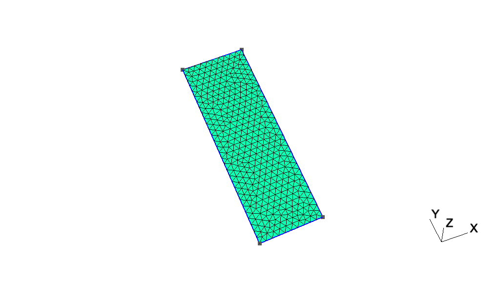
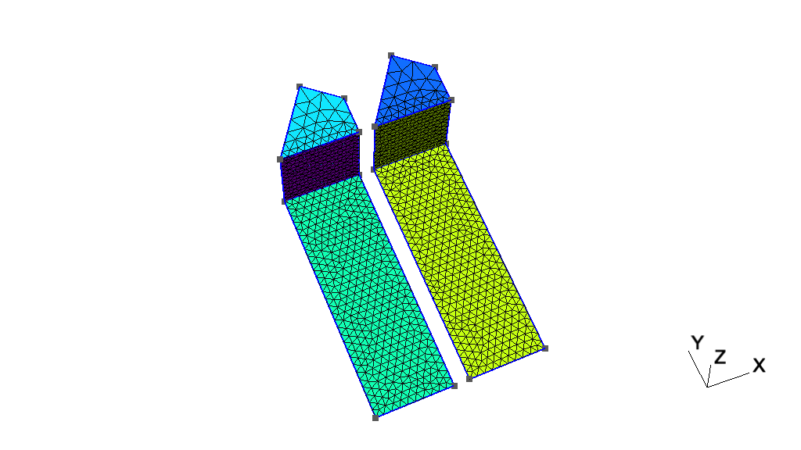
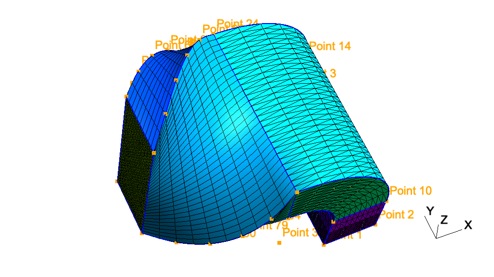
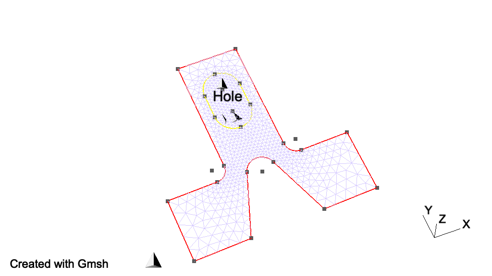

# 2 Gmsh教程

以下教程逐步介绍新功能，从第一个教程t1（参见[t1](./https://gmsh.info/doc/texinfo/gmsh.html#t1)）。相应的文件可以在Gmsh的发行版的教程目录中找到。

.geo文件是由Gmsh内置脚本语言编写的（参见[Gmsh脚本语言](./gmsh_scripting_language.md)）。你可以直接用Gmsh软件打开它们：在GUI中（参见[Gmsh图形用户界面](./gmsh_graphical_user_interface.md)），使用"File->Open"菜单，并且选择例如t1.geo打开文件，或者使用命令行，运行

> \> gmsh t1.geo

将会启动GUI，或运行

> \> gmsh t1.geo -2

以批处理模式执行网格划分（参见Gmsh命令行界面）

教程目录的c++、c、python、julia 和 fortran子目录包含使用Gmsh API编写的c++、c、python、julia 和 fortran版本的教程（参见[Gmsh应用程序接口](./gmsh_application_programming_interface.md)）。您需要Gmsh动态库和相关头文件（用于C++和C）或模块（用于Python，Julia和Fortran）来运行它们（参见[在您的的计算机上暗安装并运行Gmsh](https://gmsh.info/doc/texinfo/gmsh.html#Installing-and-running-Gmsh-on-your-computer)）。每个子目录都包含有关如何为每种受支持的语言允许教程的其他信息。

所有以字母t开头的教程均可使用脚本语言和API获得。以字母x开头的拓展教程介绍了仅可通过API获得的功能。

请注意，除了这些教程之外，Gmsh 发行版还包含许多使用内置脚本语言和 API 编写的其他示例：请参阅示例和基准。

- [t1](#t1) 几何基础、基本实体、物理群

- t2 变换、拉伸几何形状、体积

- t3 挤压网格、ONELAB 参数、选项

- t4 内置函数、表面孔洞、注释、实体颜色

- t5 网格尺寸、宏、环、体积中的孔

- t6 超限网格，删除实体

- t7 背景网格

- t8 后期处理、图像导出和动画

- t9 插件

- t10

- t11

- t12

- t13

- t14

- t15

- t16

- t17

- t18

- t19

- t20

- t21

- x1

- x2

- x3

- x4

- x5

- x6

- x7

## 2.1 t1 几何基础、基本实体、物理群

参见[t1.geo](https://gitlab.onelab.info/gmsh/gmsh/blob/gmsh_4_13_1/tutorials/t1.geo). 或者对于C++（[t1.cpp](https://gitlab.onelab.info/gmsh/gmsh/blob/gmsh_4_13_1/tutorials/c++/t1.cpp)），C（[t1.c](https://gitlab.onelab.info/gmsh/gmsh/blob/gmsh_4_13_1/tutorials/c/t1.c)），Python（[t1.py](https://gitlab.onelab.info/gmsh/gmsh/blob/gmsh_4_13_1/tutorials/python/t1.py)），Julia（[t1.jl](https://gitlab.onelab.info/gmsh/gmsh/blob/gmsh_4_13_1/tutorials/julia/t1.jl)）和Fortran（[t1.f90](https://gitlab.onelab.info/gmsh/gmsh/blob/gmsh_4_13_1/tutorials/fortran/t1.f90)）。



t1.geo文件如下

```Gmsh's
// -----------------------------------------------------------------------------
//
//  Gmsh GEO tutorial 1
//
//  Geometry basics, elementary entities, physical groups
//
// -----------------------------------------------------------------------------

// The simplest construction in Gmsh's scripting language is the
// `affectation'. The following command defines a new variable `lc':

lc = 1e-2;

// This variable can then be used in the definition of Gmsh's simplest
// `elementary entity', a `Point'. A Point is uniquely identified by a tag (a
// strictly positive integer; here `1') and defined by a list of four numbers:
// three coordinates (X, Y and Z) and the target mesh size (lc) close to the
// point:

Point(1) = {0, 0, 0, lc};

// The distribution of the mesh element sizes will then be obtained by
// interpolation of these mesh sizes throughout the geometry. Another method to
// specify mesh sizes is to use general mesh size Fields (see `t10.geo'). A
// particular case is the use of a background mesh (see `t7.geo').

// If no target mesh size of provided, a default uniform coarse size will be
// used for the model, based on the overall model size.

// We can then define some additional points. All points should have different
// tags:

Point(2) = {.1, 0,  0, lc};
Point(3) = {.1, .3, 0, lc};
Point(4) = {0,  .3, 0, lc};

// Curves are Gmsh's second type of elementary entities, and, amongst curves,
// straight lines are the simplest. A straight line is identified by a tag and
// is defined by a list of two point tags. In the commands below, for example,
// the line 1 starts at point 1 and ends at point 2.
//
// Note that curve tags are separate from point tags - hence we can reuse tag
// `1' for our first curve. And as a general rule, elementary entity tags in
// Gmsh have to be unique per geometrical dimension.

Line(1) = {1, 2};
Line(2) = {3, 2};
Line(3) = {3, 4};
Line(4) = {4, 1};

// The third elementary entity is the surface. In order to define a simple
// rectangular surface from the four curves defined above, a curve loop has
// first to be defined. A curve loop is also identified by a tag (unique amongst
// curve loops) and defined by an ordered list of connected curves, a sign being
// associated with each curve (depending on the orientation of the curve to form
// a loop):

Curve Loop(1) = {4, 1, -2, 3};

// We can then define the surface as a list of curve loops (only one here,
// representing the external contour, since there are no holes--see `t4.geo' for
// an example of a surface with a hole):

Plane Surface(1) = {1};

// At this level, Gmsh knows everything to display the rectangular surface 1 and
// to mesh it. An optional step is needed if we want to group elementary
// geometrical entities into more meaningful groups, e.g. to define some
// mathematical ("domain", "boundary"), functional ("left wing", "fuselage") or
// material ("steel", "carbon") properties.
//
// Such groups are called "Physical Groups" in Gmsh. By default, if physical
// groups are defined, Gmsh will export in output files only mesh elements that
// belong to at least one physical group. (To force Gmsh to save all elements,
// whether they belong to physical groups or not, set `Mesh.SaveAll=1;', or
// specify `-save_all' on the command line.) Physical groups are also identified
// by tags, i.e. strictly positive integers, that should be unique per dimension
// (0D, 1D, 2D or 3D). Physical groups can also be given names.
//
// Here we define a physical curve that groups the left, bottom and right curves
// in a single group (with prescribed tag 5); and a physical surface with name
// "My surface" (with an automatic tag) containing the geometrical surface 1:

Physical Curve(5) = {1, 2, 4};
Physical Surface("My surface") = {1};

// Now that the geometry is complete, you can
// - either open this file with Gmsh and select `2D' in the `Mesh' module to
//   create a mesh; then select `Save' to save it to disk in the default format
//   (or use `File->Export' to export in other formats);
// - or run `gmsh t1.geo -2` to mesh in batch mode on the command line.

// You could also uncomment the following lines in this script:
//
//   Mesh 2;
//   Save "t1.msh";
//
// which would lead Gmsh to mesh and save the mesh every time the file is
// parsed. (To simply parse the file from the command line, you can use `gmsh
// t1.geo -')

// By default, Gmsh saves meshes in the latest version of the Gmsh mesh file
// format (the `MSH' format). You can save meshes in other mesh formats by
// specifying a filename with a different extension in the GUI, on the command
// line or in scripts. For example
//
//   Save "t1.unv";
//
// will save the mesh in the UNV format. You can also save the mesh in older
// versions of the MSH format:
//
// - In the GUI: open `File->Export', enter your `filename.msh' and then pick
//   the version in the dropdown menu.
// - On the command line: use the `-format' option (e.g. `gmsh file.geo -format
//   msh2 -2').
// - In a `.geo' script: add `Mesh.MshFileVersion = x.y;' for any version
//   number `x.y'.
// - As an alternative method, you can also not specify the format explicitly,
//   and just choose a filename with the `.msh2' or `.msh4' extension.

// Note that starting with Gmsh 3.0, models can be built using other geometry
// kernels than the default built-in kernel. By specifying
//
//   SetFactory("OpenCASCADE");
//
// any subsequent command in the `.geo' file would be handled by the OpenCASCADE
// geometry kernel instead of the built-in kernel. Different geometry kernels
// have different features. With OpenCASCADE, instead of defining the surface by
// successively defining 4 points, 4 curves and 1 curve loop, one can define the
// rectangular surface directly with
//
//   Rectangle(2) = {.2, 0, 0, .1, .3};
//
// The underlying curves and points could be accessed with the `Boundary' or
// `CombinedBoundary' operators.
//
// See e.g. `t16.geo', `t18.geo', `t19.geo' or `t20.geo' for complete examples
// based on OpenCASCADE, and `examples/boolean' for more.
```

## 2.2 t2 变换、拉伸几何形状、体积

参见[t2.geo](https://gitlab.onelab.info/gmsh/gmsh/blob/gmsh_4_13_1/tutorials/t2.geo). 或者对于C++（[t2.cpp](https://gitlab.onelab.info/gmsh/gmsh/blob/gmsh_4_13_1/tutorials/c++/t2.cpp)），C（[t2.c](https://gitlab.onelab.info/gmsh/gmsh/blob/gmsh_4_13_1/tutorials/c/t2.c)），Python（[t2.py](https://gitlab.onelab.info/gmsh/gmsh/blob/gmsh_4_13_1/tutorials/python/t2.py)），Julia（[t2.jl](https://gitlab.onelab.info/gmsh/gmsh/blob/gmsh_4_13_1/tutorials/julia/t2.jl)）和Fortran（[t2.f90](https://gitlab.onelab.info/gmsh/gmsh/blob/gmsh_4_13_1/tutorials/fortran/t2.f90)）。



```GmshScriptingLanguage
// -----------------------------------------------------------------------------
//
//  Gmsh GEO tutorial 2
//
//  Transformations, extruded geometries, volumes
//
// -----------------------------------------------------------------------------

// We first include the previous tutorial file, in order to use it as a basis
// for this one. Including a file is equivalent to copy-pasting its contents:

Include "t1.geo";

// We can then add new points and curves in the same way as we did in `t1.geo':

Point(5) = {0, .4, 0, lc};
Line(5) = {4, 5};

// Gmsh also provides tools to transform (translate, rotate, etc.)
// elementary entities or copies of elementary entities. For example, point
// 5 can be moved by 0.02 to the left with:

Translate {-0.02, 0, 0} { Point{5}; }

// And it can be further rotated by -Pi/4 around (0, 0.3, 0) (with the rotation
// along the z axis) with:

Rotate {{0,0,1}, {0,0.3,0}, -Pi/4} { Point{5}; }

// Note that there are no units in Gmsh: coordinates are just numbers - it's up
// to the user to associate a meaning to them.

// Point 3 can be duplicated and translated by 0.05 along the y axis:

Translate {0, 0.05, 0} { Duplicata{ Point{3}; } }

// This command created a new point with an automatically assigned tag. This tag
// can be obtained using the graphical user interface by hovering the mouse over
// the point: in this case, the new point has tag `6'.

Line(7) = {3, 6};
Line(8) = {6, 5};
Curve Loop(10) = {5,-8,-7,3};
Plane Surface(11) = {10};

// To automate the workflow, instead of using the graphical user interface to
// obtain the tags of newly created entities, one can use the return value of
// the transformation commands directly. For example, the `Translate' command
// returns a list containing the tags of the translated entities. Let's
// translate copies of the two surfaces 1 and 11 to the right with the following
// command:

my_new_surfs[] = Translate {0.12, 0, 0} { Duplicata{ Surface{1, 11}; } };

// my_new_surfs[] (note the square brackets, and the `;' at the end of the
// command) denotes a list, which contains the tags of the two new surfaces
// (check `Tools->Message console' to see the message):

Printf("New surfaces '%g' and '%g'", my_new_surfs[0], my_new_surfs[1]);

// In Gmsh lists use square brackets for their definition (mylist[] = {1, 2,
// 3};) as well as to access their elements (myotherlist[] = {mylist[0],
// mylist[2]}; mythirdlist[] = myotherlist[];), with list indexing starting at
// 0. To get the size of a list, use the hash (pound): len = #mylist[].
//
// Note that parentheses can also be used instead of square brackets, so that we
// could also write `myfourthlist() = {mylist(0), mylist(1)};'.

// Volumes are the fourth type of elementary entities in Gmsh. In the same way
// one defines curve loops to build surfaces, one has to define surface loops
// (i.e. `shells') to build volumes. The following volume does not have holes
// and thus consists of a single surface loop:

Point(100) = {0., 0.3, 0.12, lc};  Point(101) = {0.1, 0.3, 0.12, lc};
Point(102) = {0.1, 0.35, 0.12, lc};

xyz[] = Point{5}; // Get coordinates of point 5
Point(103) = {xyz[0], xyz[1], 0.12, lc};

Line(110) = {4, 100};   Line(111) = {3, 101};
Line(112) = {6, 102};   Line(113) = {5, 103};
Line(114) = {103, 100}; Line(115) = {100, 101};
Line(116) = {101, 102}; Line(117) = {102, 103};

Curve Loop(118) = {115, -111, 3, 110};  Plane Surface(119) = {118};
Curve Loop(120) = {111, 116, -112, -7}; Plane Surface(121) = {120};
Curve Loop(122) = {112, 117, -113, -8}; Plane Surface(123) = {122};
Curve Loop(124) = {114, -110, 5, 113};  Plane Surface(125) = {124};
Curve Loop(126) = {115, 116, 117, 114}; Plane Surface(127) = {126};

Surface Loop(128) = {127, 119, 121, 123, 125, 11};
Volume(129) = {128};

// When a volume can be extruded from a surface, it is usually easier to use the
// `Extrude' command directly instead of creating all the points, curves and
// surfaces by hand. For example, the following command extrudes the surface 11
// along the z axis and automatically creates a new volume (as well as all the
// needed points, curves and surfaces):

Extrude {0, 0, 0.12} { Surface{my_new_surfs[1]}; }

// The following command permits to manually assign a mesh size to some of the
// new points:

MeshSize {103, 105, 109, 102, 28, 24, 6, 5} = lc * 3;

// We finally group volumes 129 and 130 in a single physical group with tag `1'
// and name "The volume":

Physical Volume("The volume", 1) = {129,130};

// Note that, if the transformation tools are handy to create complex
// geometries, it is also sometimes useful to generate the `flat' geometry, with
// an explicit representation of all the elementary entities.
//
// With the built-in geometry kernel, this can be achieved with `File->Export' by
// selecting the `Gmsh Unrolled GEO' format, or by adding
//
//   Save "file.geo_unrolled";
//
// in the script. It can also be achieved with `gmsh t2.geo -0' on the command
// line.
//
// With the OpenCASCADE geometry kernel, unrolling the geometry can be achieved
// with `File->Export' by selecting the `OpenCASCADE BRep' format, or by adding
//
//   Save "file.brep";
//
// in the script. (OpenCASCADE geometries can also be exported to STEP.)

// It is important to note that Gmsh never translates geometry data into a
// common representation: all the operations on a geometrical entity are
// performed natively with the associated geometry kernel. Consequently, one
// cannot export a geometry constructed with the built-in kernel as an
// OpenCASCADE BRep file; or export an OpenCASCADE model as an Unrolled GEO
// file.
```

# 2.3 t3 挤压网格、ONELAB 参数、选项

参见[t3.geo](https://gitlab.onelab.info/gmsh/gmsh/blob/gmsh_4_13_1/tutorials/t3.geo). 或者对于C++（[t3.cpp](https://gitlab.onelab.info/gmsh/gmsh/blob/gmsh_4_13_1/tutorials/c++/t3.cpp)），C（[t3.c](https://gitlab.onelab.info/gmsh/gmsh/blob/gmsh_4_13_1/tutorials/c/t3.c)），Python（[t3.py](https://gitlab.onelab.info/gmsh/gmsh/blob/gmsh_4_13_1/tutorials/python/t3.py)），Julia（[t3.jl](https://gitlab.onelab.info/gmsh/gmsh/blob/gmsh_4_13_1/tutorials/julia/t3.jl)）和Fortran（[t3.f90](https://gitlab.onelab.info/gmsh/gmsh/blob/gmsh_4_13_1/tutorials/fortran/t3.f90)）。



```GmshScriptingLanguage
// -----------------------------------------------------------------------------
//
//  Gmsh GEO tutorial 3
//
//  Extruded meshes, ONELAB parameters, options
//
// -----------------------------------------------------------------------------

// Again, we start by including the first tutorial:

Include "t1.geo";

// As in `t2.geo', we plan to perform an extrusion along the z axis.  But here,
// instead of only extruding the geometry, we also want to extrude the 2D
// mesh. This is done with the same `Extrude' command, but by specifying element
// 'Layers' (2 layers in this case, the first one with 8 subdivisions and the
// second one with 2 subdivisions, both with a height of h/2):

h = 0.1;

Extrude {0,0,h} {
  Surface{1}; Layers{ {8,2}, {0.5,1} };
}

// The extrusion can also be performed with a rotation instead of a translation,
// and the resulting mesh can be recombined into prisms (we use only one layer
// here, with 7 subdivisions). All rotations are specified by an axis direction
// ({0,1,0}), an axis point ({-0.1,0,0.1}) and a rotation angle (-Pi/2):

Extrude { {0,1,0} , {-0.1,0,0.1} , -Pi/2 } {
  Surface{28}; Layers{7}; Recombine;
}

// Using the built-in geometry kernel, only rotations with angles < Pi are
// supported. To do a full turn, you will thus need to apply at least 3
// rotations. The OpenCASCADE geometry kernel does not have this limitation.

// Note that a translation ({-2*h,0,0}) and a rotation ({1,0,0}, {0,0.15,0.25},
// Pi/2) can also be combined to form a "twist". Here the angle is specified as
// a ONELAB parameter, using the `DefineConstant' syntax. ONELAB parameters can
// be modified interactively in the GUI, and can be exchanged with other codes
// connected to the same ONELAB database:

DefineConstant[ angle = {90, Min 0, Max 120, Step 1,
                         Name "Parameters/Twisting angle"} ];

// In more details, `DefineConstant' allows you to assign the value of the
// ONELAB parameter "Parameters/Twisting angle" to the variable `angle'. If the
// ONELAB parameter does not exist in the database, `DefineConstant' will create
// it and assign the default value `90'. Moreover, if the variable `angle' was
// defined before the call to `DefineConstant', the `DefineConstant' call would
// simply be skipped. This allows to build generic parametric models, whose
// parameters can be frozen from the outside - the parameters ceasing to be
// "parameters".
//
// An interesting use of this feature is in conjunction with the `-setnumber
// name value' command line switch, which defines a variable `name' with value
// `value'. Calling `gmsh t3.geo -setnumber angle 30' would define `angle'
// before the `DefineConstant', making `t3.geo' non-parametric
// ("Parameters/Twisting angle" will not be created in the ONELAB database and
// will not be available for modification in the graphical user interface).

out[] = Extrude { {-2*h,0,0}, {1,0,0} , {0,0.15,0.25} , angle * Pi / 180 } {
  Surface{50}; Layers{10}; Recombine;
};

// In this last extrusion command we retrieved the volume number
// programmatically by using the return value (a list) of the `Extrude'
// command. This list contains the "top" of the extruded surface (in `out[0]'),
// the newly created volume (in `out[1]') and the tags of the lateral surfaces
// (in `out[2]', `out[3]', ...).

// We can then define a new physical volume (with tag 101) to group all the
// elementary volumes:

Physical Volume(101) = {1, 2, out[1]};

// Let us now change some options... Since all interactive options are
// accessible in Gmsh's scripting language, we can for example make point tags
// visible or redefine some colors directly in the input file:

Geometry.PointNumbers = 1;
Geometry.Color.Points = Orange;
General.Color.Text = White;
Mesh.Color.Points = {255, 0, 0};

// Note that all colors can be defined literally or numerically, i.e.
// `Mesh.Color.Points = Red' is equivalent to `Mesh.Color.Points = {255,0,0}';
// and also note that, as with user-defined variables, the options can be used
// either as right or left hand sides, so that the following command will set
// the surface color to the same color as the points:

Geometry.Color.Surfaces = Geometry.Color.Points;

// You can use the `Help->Current Options and Workspace' menu to see the current
// values of all options. To save all the options in a file, use
// `File->Export->Gmsh Options'. To associate the current options with the
// current file use `File->Save Model Options'. To save the current options for
// all future Gmsh sessions use `File->Save Options As Default'.
```

# 2.4 t4 内置函数、表面孔洞、注释、实体颜色

参见[t4.geo](https://gitlab.onelab.info/gmsh/gmsh/blob/gmsh_4_13_1/tutorials/t4.geo). 或者对于C++（[t4.cpp](https://gitlab.onelab.info/gmsh/gmsh/blob/gmsh_4_13_1/tutorials/c++/t4.cpp)），C（[t4.c](https://gitlab.onelab.info/gmsh/gmsh/blob/gmsh_4_13_1/tutorials/c/t4.c)），Python（[t4.py](https://gitlab.onelab.info/gmsh/gmsh/blob/gmsh_4_13_1/tutorials/python/t4.py)），Julia（[t4.jl](https://gitlab.onelab.info/gmsh/gmsh/blob/gmsh_4_13_1/tutorials/julia/t4.jl)）和Fortran（[t4.f90](https://gitlab.onelab.info/gmsh/gmsh/blob/gmsh_4_13_1/tutorials/fortran/t4.f90)）。



```GmshScriptingLanguage

```
