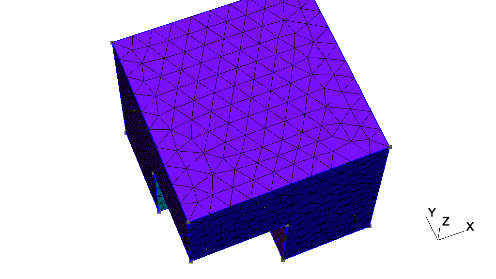
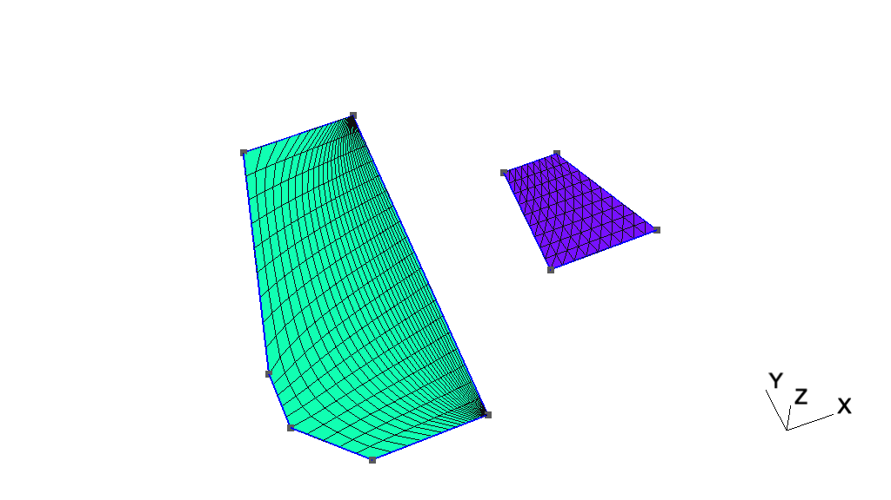
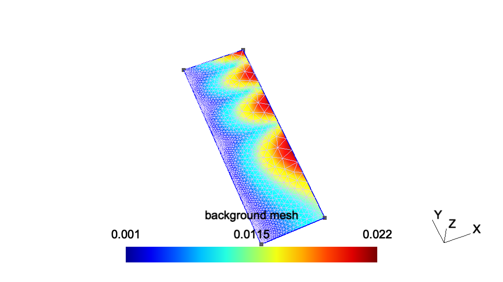
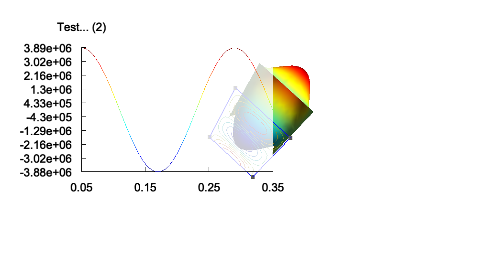
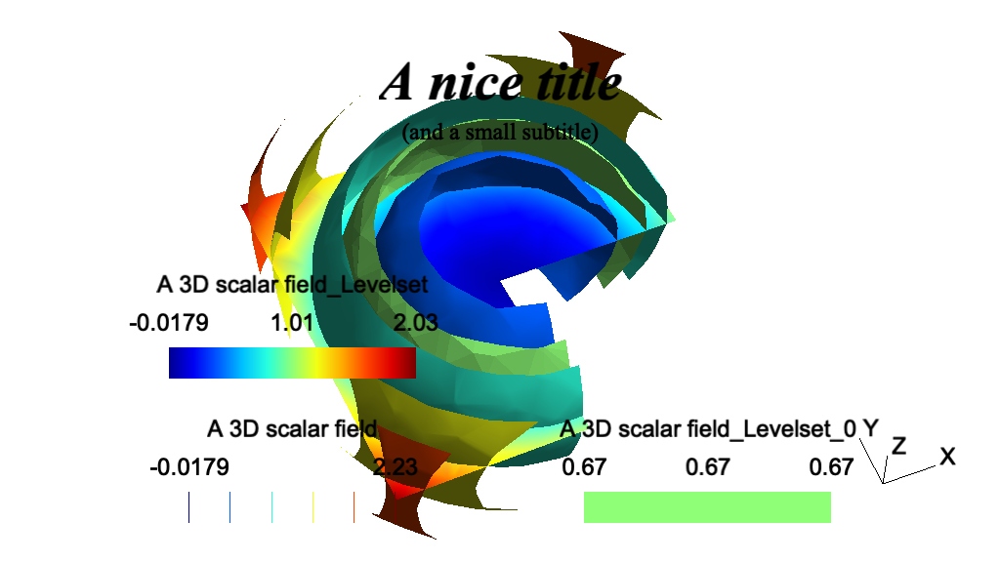

# 2 Gmsh教程

以下教程逐步介绍新功能，从第一个教程t1（参见[t1](./https://gmsh.info/doc/texinfo/gmsh.html#t1)）。相应的文件可以在Gmsh的发行版的教程目录中找到。

.geo文件是由Gmsh内置脚本语言编写的（参见[Gmsh脚本语言](./gmsh_scripting_language.md)）。你可以直接用Gmsh软件打开它们：在GUI中（参见[Gmsh图形用户界面](./gmsh_graphical_user_interface.md)），使用"File->Open"菜单，并且选择例如t1.geo打开文件，或者使用命令行，运行

> \> gmsh t1.geo

将会启动GUI，或运行

> \> gmsh t1.geo -2

以批处理模式执行网格划分（参见Gmsh命令行界面）

教程目录的c++、c、python、julia 和 fortran子目录包含使用Gmsh API编写的c++、c、python、julia 和 fortran版本的教程（参见[Gmsh应用程序接口](./gmsh_application_programming_interface.md)）。您需要Gmsh动态库和相关头文件（用于C++和C）或模块（用于Python，Julia和Fortran）来运行它们（参见[在您的的计算机上暗安装并运行Gmsh](https://gmsh.info/doc/texinfo/gmsh.html#Installing-and-running-Gmsh-on-your-computer)）。每个子目录都包含有关如何为每种受支持的语言允许教程的其他信息。

所有以字母t开头的教程均可使用脚本语言和API获得。以字母x开头的拓展教程介绍了仅可通过API获得的功能。

请注意，除了这些教程之外，Gmsh 发行版还包含许多使用内置脚本语言和 API 编写的其他示例：请参阅示例和基准。

- [t1](#t1) 几何基础、基本实体、物理群

- t2 变换、拉伸几何形状、体积

- t3 挤压网格、ONELAB 参数、选项

- t4 内置函数、表面孔洞、注释、实体颜色

- t5 网格尺寸、宏、环、体积中的孔

- t6 超限网格，删除实体

- t7 背景网格

- t8 后处理、图像导出和动画

- t9 插件

- t10

- t11

- t12

- t13

- t14

- t15

- t16

- t17

- t18

- t19

- t20

- t21

- x1

- x2

- x3

- x4

- x5

- x6

- x7

## 2.1 t1 几何基础、基本实体、物理群

参见[t1.geo](https://gitlab.onelab.info/gmsh/gmsh/blob/gmsh_4_13_1/tutorials/t1.geo). 或者对于C++（[t1.cpp](https://gitlab.onelab.info/gmsh/gmsh/blob/gmsh_4_13_1/tutorials/c++/t1.cpp)），C（[t1.c](https://gitlab.onelab.info/gmsh/gmsh/blob/gmsh_4_13_1/tutorials/c/t1.c)），Python（[t1.py](https://gitlab.onelab.info/gmsh/gmsh/blob/gmsh_4_13_1/tutorials/python/t1.py)），Julia（[t1.jl](https://gitlab.onelab.info/gmsh/gmsh/blob/gmsh_4_13_1/tutorials/julia/t1.jl)）和Fortran（[t1.f90](https://gitlab.onelab.info/gmsh/gmsh/blob/gmsh_4_13_1/tutorials/fortran/t1.f90)）。


t1.geo文件如下

```Gmsh's
// -----------------------------------------------------------------------------
//
//  Gmsh GEO tutorial 1
//
//  Geometry basics, elementary entities, physical groups
//
// -----------------------------------------------------------------------------

// The simplest construction in Gmsh's scripting language is the
// `affectation'. The following command defines a new variable `lc':

lc = 1e-2;

// This variable can then be used in the definition of Gmsh's simplest
// `elementary entity', a `Point'. A Point is uniquely identified by a tag (a
// strictly positive integer; here `1') and defined by a list of four numbers:
// three coordinates (X, Y and Z) and the target mesh size (lc) close to the
// point:

Point(1) = {0, 0, 0, lc};

// The distribution of the mesh element sizes will then be obtained by
// interpolation of these mesh sizes throughout the geometry. Another method to
// specify mesh sizes is to use general mesh size Fields (see `t10.geo'). A
// particular case is the use of a background mesh (see `t7.geo').

// If no target mesh size of provided, a default uniform coarse size will be
// used for the model, based on the overall model size.

// We can then define some additional points. All points should have different
// tags:

Point(2) = {.1, 0,  0, lc};
Point(3) = {.1, .3, 0, lc};
Point(4) = {0,  .3, 0, lc};

// Curves are Gmsh's second type of elementary entities, and, amongst curves,
// straight lines are the simplest. A straight line is identified by a tag and
// is defined by a list of two point tags. In the commands below, for example,
// the line 1 starts at point 1 and ends at point 2.
//
// Note that curve tags are separate from point tags - hence we can reuse tag
// `1' for our first curve. And as a general rule, elementary entity tags in
// Gmsh have to be unique per geometrical dimension.

Line(1) = {1, 2};
Line(2) = {3, 2};
Line(3) = {3, 4};
Line(4) = {4, 1};

// The third elementary entity is the surface. In order to define a simple
// rectangular surface from the four curves defined above, a curve loop has
// first to be defined. A curve loop is also identified by a tag (unique amongst
// curve loops) and defined by an ordered list of connected curves, a sign being
// associated with each curve (depending on the orientation of the curve to form
// a loop):

Curve Loop(1) = {4, 1, -2, 3};

// We can then define the surface as a list of curve loops (only one here,
// representing the external contour, since there are no holes--see `t4.geo' for
// an example of a surface with a hole):

Plane Surface(1) = {1};

// At this level, Gmsh knows everything to display the rectangular surface 1 and
// to mesh it. An optional step is needed if we want to group elementary
// geometrical entities into more meaningful groups, e.g. to define some
// mathematical ("domain", "boundary"), functional ("left wing", "fuselage") or
// material ("steel", "carbon") properties.
//
// Such groups are called "Physical Groups" in Gmsh. By default, if physical
// groups are defined, Gmsh will export in output files only mesh elements that
// belong to at least one physical group. (To force Gmsh to save all elements,
// whether they belong to physical groups or not, set `Mesh.SaveAll=1;', or
// specify `-save_all' on the command line.) Physical groups are also identified
// by tags, i.e. strictly positive integers, that should be unique per dimension
// (0D, 1D, 2D or 3D). Physical groups can also be given names.
//
// Here we define a physical curve that groups the left, bottom and right curves
// in a single group (with prescribed tag 5); and a physical surface with name
// "My surface" (with an automatic tag) containing the geometrical surface 1:

Physical Curve(5) = {1, 2, 4};
Physical Surface("My surface") = {1};

// Now that the geometry is complete, you can
// - either open this file with Gmsh and select `2D' in the `Mesh' module to
//   create a mesh; then select `Save' to save it to disk in the default format
//   (or use `File->Export' to export in other formats);
// - or run `gmsh t1.geo -2` to mesh in batch mode on the command line.

// You could also uncomment the following lines in this script:
//
//   Mesh 2;
//   Save "t1.msh";
//
// which would lead Gmsh to mesh and save the mesh every time the file is
// parsed. (To simply parse the file from the command line, you can use `gmsh
// t1.geo -')

// By default, Gmsh saves meshes in the latest version of the Gmsh mesh file
// format (the `MSH' format). You can save meshes in other mesh formats by
// specifying a filename with a different extension in the GUI, on the command
// line or in scripts. For example
//
//   Save "t1.unv";
//
// will save the mesh in the UNV format. You can also save the mesh in older
// versions of the MSH format:
//
// - In the GUI: open `File->Export', enter your `filename.msh' and then pick
//   the version in the dropdown menu.
// - On the command line: use the `-format' option (e.g. `gmsh file.geo -format
//   msh2 -2').
// - In a `.geo' script: add `Mesh.MshFileVersion = x.y;' for any version
//   number `x.y'.
// - As an alternative method, you can also not specify the format explicitly,
//   and just choose a filename with the `.msh2' or `.msh4' extension.

// Note that starting with Gmsh 3.0, models can be built using other geometry
// kernels than the default built-in kernel. By specifying
//
//   SetFactory("OpenCASCADE");
//
// any subsequent command in the `.geo' file would be handled by the OpenCASCADE
// geometry kernel instead of the built-in kernel. Different geometry kernels
// have different features. With OpenCASCADE, instead of defining the surface by
// successively defining 4 points, 4 curves and 1 curve loop, one can define the
// rectangular surface directly with
//
//   Rectangle(2) = {.2, 0, 0, .1, .3};
//
// The underlying curves and points could be accessed with the `Boundary' or
// `CombinedBoundary' operators.
//
// See e.g. `t16.geo', `t18.geo', `t19.geo' or `t20.geo' for complete examples
// based on OpenCASCADE, and `examples/boolean' for more.
```

## 2.2 t2 变换、拉伸几何形状、体积

参见[t2.geo](https://gitlab.onelab.info/gmsh/gmsh/blob/gmsh_4_13_1/tutorials/t2.geo). 或者对于C++（[t2.cpp](https://gitlab.onelab.info/gmsh/gmsh/blob/gmsh_4_13_1/tutorials/c++/t2.cpp)），C（[t2.c](https://gitlab.onelab.info/gmsh/gmsh/blob/gmsh_4_13_1/tutorials/c/t2.c)），Python（[t2.py](https://gitlab.onelab.info/gmsh/gmsh/blob/gmsh_4_13_1/tutorials/python/t2.py)），Julia（[t2.jl](https://gitlab.onelab.info/gmsh/gmsh/blob/gmsh_4_13_1/tutorials/julia/t2.jl)）和Fortran（[t2.f90](https://gitlab.onelab.info/gmsh/gmsh/blob/gmsh_4_13_1/tutorials/fortran/t2.f90)）。


```GmshScriptingLanguage
// -----------------------------------------------------------------------------
//
//  Gmsh GEO tutorial 2
//
//  Transformations, extruded geometries, volumes
//
// -----------------------------------------------------------------------------

// We first include the previous tutorial file, in order to use it as a basis
// for this one. Including a file is equivalent to copy-pasting its contents:

Include "t1.geo";

// We can then add new points and curves in the same way as we did in `t1.geo':

Point(5) = {0, .4, 0, lc};
Line(5) = {4, 5};

// Gmsh also provides tools to transform (translate, rotate, etc.)
// elementary entities or copies of elementary entities. For example, point
// 5 can be moved by 0.02 to the left with:

Translate {-0.02, 0, 0} { Point{5}; }

// And it can be further rotated by -Pi/4 around (0, 0.3, 0) (with the rotation
// along the z axis) with:

Rotate {{0,0,1}, {0,0.3,0}, -Pi/4} { Point{5}; }

// Note that there are no units in Gmsh: coordinates are just numbers - it's up
// to the user to associate a meaning to them.

// Point 3 can be duplicated and translated by 0.05 along the y axis:

Translate {0, 0.05, 0} { Duplicata{ Point{3}; } }

// This command created a new point with an automatically assigned tag. This tag
// can be obtained using the graphical user interface by hovering the mouse over
// the point: in this case, the new point has tag `6'.

Line(7) = {3, 6};
Line(8) = {6, 5};
Curve Loop(10) = {5,-8,-7,3};
Plane Surface(11) = {10};

// To automate the workflow, instead of using the graphical user interface to
// obtain the tags of newly created entities, one can use the return value of
// the transformation commands directly. For example, the `Translate' command
// returns a list containing the tags of the translated entities. Let's
// translate copies of the two surfaces 1 and 11 to the right with the following
// command:

my_new_surfs[] = Translate {0.12, 0, 0} { Duplicata{ Surface{1, 11}; } };

// my_new_surfs[] (note the square brackets, and the `;' at the end of the
// command) denotes a list, which contains the tags of the two new surfaces
// (check `Tools->Message console' to see the message):

Printf("New surfaces '%g' and '%g'", my_new_surfs[0], my_new_surfs[1]);

// In Gmsh lists use square brackets for their definition (mylist[] = {1, 2,
// 3};) as well as to access their elements (myotherlist[] = {mylist[0],
// mylist[2]}; mythirdlist[] = myotherlist[];), with list indexing starting at
// 0. To get the size of a list, use the hash (pound): len = #mylist[].
//
// Note that parentheses can also be used instead of square brackets, so that we
// could also write `myfourthlist() = {mylist(0), mylist(1)};'.

// Volumes are the fourth type of elementary entities in Gmsh. In the same way
// one defines curve loops to build surfaces, one has to define surface loops
// (i.e. `shells') to build volumes. The following volume does not have holes
// and thus consists of a single surface loop:

Point(100) = {0., 0.3, 0.12, lc};  Point(101) = {0.1, 0.3, 0.12, lc};
Point(102) = {0.1, 0.35, 0.12, lc};

xyz[] = Point{5}; // Get coordinates of point 5
Point(103) = {xyz[0], xyz[1], 0.12, lc};

Line(110) = {4, 100};   Line(111) = {3, 101};
Line(112) = {6, 102};   Line(113) = {5, 103};
Line(114) = {103, 100}; Line(115) = {100, 101};
Line(116) = {101, 102}; Line(117) = {102, 103};

Curve Loop(118) = {115, -111, 3, 110};  Plane Surface(119) = {118};
Curve Loop(120) = {111, 116, -112, -7}; Plane Surface(121) = {120};
Curve Loop(122) = {112, 117, -113, -8}; Plane Surface(123) = {122};
Curve Loop(124) = {114, -110, 5, 113};  Plane Surface(125) = {124};
Curve Loop(126) = {115, 116, 117, 114}; Plane Surface(127) = {126};

Surface Loop(128) = {127, 119, 121, 123, 125, 11};
Volume(129) = {128};

// When a volume can be extruded from a surface, it is usually easier to use the
// `Extrude' command directly instead of creating all the points, curves and
// surfaces by hand. For example, the following command extrudes the surface 11
// along the z axis and automatically creates a new volume (as well as all the
// needed points, curves and surfaces):

Extrude {0, 0, 0.12} { Surface{my_new_surfs[1]}; }

// The following command permits to manually assign a mesh size to some of the
// new points:

MeshSize {103, 105, 109, 102, 28, 24, 6, 5} = lc * 3;

// We finally group volumes 129 and 130 in a single physical group with tag `1'
// and name "The volume":

Physical Volume("The volume", 1) = {129,130};

// Note that, if the transformation tools are handy to create complex
// geometries, it is also sometimes useful to generate the `flat' geometry, with
// an explicit representation of all the elementary entities.
//
// With the built-in geometry kernel, this can be achieved with `File->Export' by
// selecting the `Gmsh Unrolled GEO' format, or by adding
//
//   Save "file.geo_unrolled";
//
// in the script. It can also be achieved with `gmsh t2.geo -0' on the command
// line.
//
// With the OpenCASCADE geometry kernel, unrolling the geometry can be achieved
// with `File->Export' by selecting the `OpenCASCADE BRep' format, or by adding
//
//   Save "file.brep";
//
// in the script. (OpenCASCADE geometries can also be exported to STEP.)

// It is important to note that Gmsh never translates geometry data into a
// common representation: all the operations on a geometrical entity are
// performed natively with the associated geometry kernel. Consequently, one
// cannot export a geometry constructed with the built-in kernel as an
// OpenCASCADE BRep file; or export an OpenCASCADE model as an Unrolled GEO
// file.
```

## 2.3 t3 挤压网格、ONELAB 参数、选项

参见[t3.geo](https://gitlab.onelab.info/gmsh/gmsh/blob/gmsh_4_13_1/tutorials/t3.geo). 或者对于C++（[t3.cpp](https://gitlab.onelab.info/gmsh/gmsh/blob/gmsh_4_13_1/tutorials/c++/t3.cpp)），C（[t3.c](https://gitlab.onelab.info/gmsh/gmsh/blob/gmsh_4_13_1/tutorials/c/t3.c)），Python（[t3.py](https://gitlab.onelab.info/gmsh/gmsh/blob/gmsh_4_13_1/tutorials/python/t3.py)），Julia（[t3.jl](https://gitlab.onelab.info/gmsh/gmsh/blob/gmsh_4_13_1/tutorials/julia/t3.jl)）和Fortran（[t3.f90](https://gitlab.onelab.info/gmsh/gmsh/blob/gmsh_4_13_1/tutorials/fortran/t3.f90)）。


```GmshScriptingLanguage
// -----------------------------------------------------------------------------
//
//  Gmsh GEO tutorial 3
//
//  Extruded meshes, ONELAB parameters, options
//
// -----------------------------------------------------------------------------

// Again, we start by including the first tutorial:

Include "t1.geo";

// As in `t2.geo', we plan to perform an extrusion along the z axis.  But here,
// instead of only extruding the geometry, we also want to extrude the 2D
// mesh. This is done with the same `Extrude' command, but by specifying element
// 'Layers' (2 layers in this case, the first one with 8 subdivisions and the
// second one with 2 subdivisions, both with a height of h/2):

h = 0.1;

Extrude {0,0,h} {
  Surface{1}; Layers{ {8,2}, {0.5,1} };
}

// The extrusion can also be performed with a rotation instead of a translation,
// and the resulting mesh can be recombined into prisms (we use only one layer
// here, with 7 subdivisions). All rotations are specified by an axis direction
// ({0,1,0}), an axis point ({-0.1,0,0.1}) and a rotation angle (-Pi/2):

Extrude { {0,1,0} , {-0.1,0,0.1} , -Pi/2 } {
  Surface{28}; Layers{7}; Recombine;
}

// Using the built-in geometry kernel, only rotations with angles < Pi are
// supported. To do a full turn, you will thus need to apply at least 3
// rotations. The OpenCASCADE geometry kernel does not have this limitation.

// Note that a translation ({-2*h,0,0}) and a rotation ({1,0,0}, {0,0.15,0.25},
// Pi/2) can also be combined to form a "twist". Here the angle is specified as
// a ONELAB parameter, using the `DefineConstant' syntax. ONELAB parameters can
// be modified interactively in the GUI, and can be exchanged with other codes
// connected to the same ONELAB database:

DefineConstant[ angle = {90, Min 0, Max 120, Step 1,
                         Name "Parameters/Twisting angle"} ];

// In more details, `DefineConstant' allows you to assign the value of the
// ONELAB parameter "Parameters/Twisting angle" to the variable `angle'. If the
// ONELAB parameter does not exist in the database, `DefineConstant' will create
// it and assign the default value `90'. Moreover, if the variable `angle' was
// defined before the call to `DefineConstant', the `DefineConstant' call would
// simply be skipped. This allows to build generic parametric models, whose
// parameters can be frozen from the outside - the parameters ceasing to be
// "parameters".
//
// An interesting use of this feature is in conjunction with the `-setnumber
// name value' command line switch, which defines a variable `name' with value
// `value'. Calling `gmsh t3.geo -setnumber angle 30' would define `angle'
// before the `DefineConstant', making `t3.geo' non-parametric
// ("Parameters/Twisting angle" will not be created in the ONELAB database and
// will not be available for modification in the graphical user interface).

out[] = Extrude { {-2*h,0,0}, {1,0,0} , {0,0.15,0.25} , angle * Pi / 180 } {
  Surface{50}; Layers{10}; Recombine;
};

// In this last extrusion command we retrieved the volume number
// programmatically by using the return value (a list) of the `Extrude'
// command. This list contains the "top" of the extruded surface (in `out[0]'),
// the newly created volume (in `out[1]') and the tags of the lateral surfaces
// (in `out[2]', `out[3]', ...).

// We can then define a new physical volume (with tag 101) to group all the
// elementary volumes:

Physical Volume(101) = {1, 2, out[1]};

// Let us now change some options... Since all interactive options are
// accessible in Gmsh's scripting language, we can for example make point tags
// visible or redefine some colors directly in the input file:

Geometry.PointNumbers = 1;
Geometry.Color.Points = Orange;
General.Color.Text = White;
Mesh.Color.Points = {255, 0, 0};

// Note that all colors can be defined literally or numerically, i.e.
// `Mesh.Color.Points = Red' is equivalent to `Mesh.Color.Points = {255,0,0}';
// and also note that, as with user-defined variables, the options can be used
// either as right or left hand sides, so that the following command will set
// the surface color to the same color as the points:

Geometry.Color.Surfaces = Geometry.Color.Points;

// You can use the `Help->Current Options and Workspace' menu to see the current
// values of all options. To save all the options in a file, use
// `File->Export->Gmsh Options'. To associate the current options with the
// current file use `File->Save Model Options'. To save the current options for
// all future Gmsh sessions use `File->Save Options As Default'.
```

## 2.4 t4 内置函数、表面孔洞、注释、实体颜色

参见[t4.geo](https://gitlab.onelab.info/gmsh/gmsh/blob/gmsh_4_13_1/tutorials/t4.geo). 或者对于C++（[t4.cpp](https://gitlab.onelab.info/gmsh/gmsh/blob/gmsh_4_13_1/tutorials/c++/t4.cpp)），C（[t4.c](https://gitlab.onelab.info/gmsh/gmsh/blob/gmsh_4_13_1/tutorials/c/t4.c)），Python（[t4.py](https://gitlab.onelab.info/gmsh/gmsh/blob/gmsh_4_13_1/tutorials/python/t4.py)），Julia（[t4.jl](https://gitlab.onelab.info/gmsh/gmsh/blob/gmsh_4_13_1/tutorials/julia/t4.jl)）和Fortran（[t4.f90](https://gitlab.onelab.info/gmsh/gmsh/blob/gmsh_4_13_1/tutorials/fortran/t4.f90)）。


```GmshScriptingLanguage
// -----------------------------------------------------------------------------
//
//  Gmsh GEO tutorial 4
//
//  Built-in functions, holes in surfaces, annotations, entity colors
//
// -----------------------------------------------------------------------------

// As usual, we start by defining some variables:

cm = 1e-02;
e1 = 4.5 * cm; e2 = 6 * cm / 2; e3 =  5 * cm / 2;
h1 = 5 * cm; h2 = 10 * cm; h3 = 5 * cm; h4 = 2 * cm; h5 = 4.5 * cm;
R1 = 1 * cm; R2 = 1.5 * cm; r = 1 * cm;
Lc1 = 0.01;
Lc2 = 0.003;

// We can use all the usual mathematical functions (note the capitalized first
// letters), plus some useful functions like Hypot(a, b) := Sqrt(a^2 + b^2):

ccos = (-h5*R1 + e2 * Hypot(h5, Hypot(e2, R1))) / (h5^2 + e2^2);
ssin = Sqrt(1 - ccos^2);

// Then we define some points and some lines using these variables:

Point(1) = {-e1-e2, 0    , 0, Lc1}; Point(2) = {-e1-e2, h1   , 0, Lc1};
Point(3) = {-e3-r , h1   , 0, Lc2}; Point(4) = {-e3-r , h1+r , 0, Lc2};
Point(5) = {-e3   , h1+r , 0, Lc2}; Point(6) = {-e3   , h1+h2, 0, Lc1};
Point(7) = { e3   , h1+h2, 0, Lc1}; Point(8) = { e3   , h1+r , 0, Lc2};
Point(9) = { e3+r , h1+r , 0, Lc2}; Point(10)= { e3+r , h1   , 0, Lc2};
Point(11)= { e1+e2, h1   , 0, Lc1}; Point(12)= { e1+e2, 0    , 0, Lc1};
Point(13)= { e2   , 0    , 0, Lc1};

Point(14)= { R1 / ssin, h5+R1*ccos, 0, Lc2};
Point(15)= { 0        , h5        , 0, Lc2};
Point(16)= {-R1 / ssin, h5+R1*ccos, 0, Lc2};
Point(17)= {-e2       , 0.0       , 0, Lc1};

Point(18)= {-R2 , h1+h3   , 0, Lc2}; Point(19)= {-R2 , h1+h3+h4, 0, Lc2};
Point(20)= { 0  , h1+h3+h4, 0, Lc2}; Point(21)= { R2 , h1+h3+h4, 0, Lc2};
Point(22)= { R2 , h1+h3   , 0, Lc2}; Point(23)= { 0  , h1+h3   , 0, Lc2};

Point(24)= { 0, h1+h3+h4+R2, 0, Lc2}; Point(25)= { 0, h1+h3-R2,    0, Lc2};

Line(1)  = {1 , 17};
Line(2)  = {17, 16};

// Gmsh provides other curve primitives than straight lines: splines, B-splines,
// circle arcs, ellipse arcs, etc. Here we define a new circle arc, starting at
// point 14 and ending at point 16, with the circle's center being the point 15:

Circle(3) = {14,15,16};

// Note that, in Gmsh, circle arcs should always be smaller than Pi. The
// OpenCASCADE geometry kernel does not have this limitation.

// We can then define additional lines and circles, as well as a new surface:

Line(4)  = {14, 13}; Line(5)   = {13, 12};   Line(6)    = {12, 11};
Line(7)  = {11, 10}; Circle(8) = {8, 9, 10}; Line(9)    = {8, 7};
Line(10) = {7, 6};   Line(11)  = {6, 5};     Circle(12) = {3, 4, 5};
Line(13) = {3, 2};   Line(14)  = {2, 1};     Line(15)   = {18, 19};
Circle(16) = {21, 20, 24}; Circle(17) = {24, 20, 19};
Circle(18) = {18, 23, 25}; Circle(19) = {25, 23, 22};
Line(20) = {21,22};

Curve Loop(21) = {17, -15, 18, 19, -20, 16};
Plane Surface(22) = {21};

// But we still need to define the exterior surface. Since this surface has a
// hole, its definition now requires two curves loops:

Curve Loop(23) = {11, -12, 13, 14, 1, 2, -3, 4, 5, 6, 7, -8, 9, 10};
Plane Surface(24) = {23, 21};

// As a general rule, if a surface has N holes, it is defined by N+1 curve loops:
// the first loop defines the exterior boundary; the other loops define the
// boundaries of the holes.

// Finally, we can add some comments by embedding a post-processing view
// containing some strings:

View "comments" {
  // Add a text string in window coordinates, 10 pixels from the left and 10
  // pixels from the bottom, using the `StrCat' function to concatenate strings:
  T2(10, -10, 0){ StrCat("Created on ", Today, " with Gmsh") };

  // Add a text string in model coordinates centered at (X,Y,Z) = (0, 0.11, 0):
  T3(0, 0.11, 0, TextAttributes("Align", "Center", "Font", "Helvetica")){
    "Hole"
  };

  // If a string starts with `file://', the rest is interpreted as an image
  // file. For 3D annotations, the size in model coordinates can be specified
  // after a `@' symbol in the form `widthxheight' (if one of `width' or
  // `height' is zero, natural scaling is used; if both are zero, original image
  // dimensions in pixels are used):
  T3(0, 0.09, 0, TextAttributes("Align", "Center")){
    "file://t4_image.png@0.01x0"
  };

  // The 3D orientation of the image can be specified by proving the direction
  // of the bottom and left edge of the image in model space:
  T3(-0.01, 0.09, 0, 0){ "file://t4_image.png@0.01x0,0,0,1,0,1,0" };

  // The image can also be drawn in "billboard" mode, i.e. always parallel to
  // the camera, by using the `#' symbol:
  T3(0, 0.12, 0, TextAttributes("Align", "Center")){
    "file://t4_image.png@0.01x0#"
  };

  // The size of 2D annotations is given directly in pixels:
  T2(350, -7, 0){ "file://t4_image.png@20x0" };
};

// This post-processing view is in the "parsed" format, i.e. it is interpreted
// using the same parser as the `.geo' file. For large post-processing datasets,
// that contain actual field values defined on a mesh, you should use the MSH
// file format instead, which allows to efficiently store continuous or
// discontinuous scalar, vector and tensor fields, or arbitrary polynomial
// order.

// Views and geometrical entities can be made to respond to double-click events,
// here to print some messages to the console:

View[0].DoubleClickedCommand = "Printf('View[0] has been double-clicked!');";
Geometry.DoubleClickedCurveCommand = "Printf('Curve %g has been double-clicked!',
  Geometry.DoubleClickedEntityTag);";

// We can also change the color of some entities:

Color Grey50{ Surface{ 22 }; }
Color Purple{ Surface{ 24 }; }
Color Red{ Curve{ 1:14 }; }
Color Yellow{ Curve{ 15:20 }; }
```

## 2.5 t5 网格尺寸、宏、环、体积中的孔

参见 [t5.geo](https://gitlab.onelab.info/gmsh/gmsh/blob/gmsh_4_13_1/tutorials/t5.geo). 或者对于 C++ ([t5.cpp](https://gitlab.onelab.info/gmsh/gmsh/blob/gmsh_4_13_1/tutorials/c++/t5.cpp)), Python ([t5.py](https://gitlab.onelab.info/gmsh/gmsh/blob/gmsh_4_13_1/tutorials/python/t5.py)), Julia ([t5.jl](https://gitlab.onelab.info/gmsh/gmsh/blob/gmsh_4_13_1/tutorials/julia/t5.jl)) 和 Fortran ([t5.f90](https://gitlab.onelab.info/gmsh/gmsh/blob/gmsh_4_13_1/tutorials/fortran/t5.f90)).



```GmshScriptingLanguage
// -----------------------------------------------------------------------------
//
//  Gmsh GEO tutorial 5
//
//  Mesh sizes, macros, loops, holes in volumes
//
// -----------------------------------------------------------------------------

// We start by defining some target mesh sizes:

lcar1 = .1;
lcar2 = .0005;
lcar3 = .055;

// If we wanted to change these mesh sizes globally (without changing the above
// definitions), we could give a global scaling factor for all mesh sizes on the
// command line with the `-clscale' option (or with `Mesh.MeshSizeFactor' in an
// option file). For example, with:
//
// > gmsh t5.geo -clscale 1
//
// this input file produces a mesh of approximately 3000 nodes and 14,000
// tetrahedra. With
//
// > gmsh t5.geo -clscale 0.2
//
// the mesh counts approximately 231,000 nodes and 1,360,000 tetrahedra. You can
// check mesh statistics in the graphical user interface with the
// `Tools->Statistics' menu.
//
// See `t10.geo' for more information about mesh sizes.

// We proceed by defining some elementary entities describing a truncated cube:

Point(1) = {0.5,0.5,0.5,lcar2}; Point(2) = {0.5,0.5,0,lcar1};
Point(3) = {0,0.5,0.5,lcar1};   Point(4) = {0,0,0.5,lcar1};
Point(5) = {0.5,0,0.5,lcar1};   Point(6) = {0.5,0,0,lcar1};
Point(7) = {0,0.5,0,lcar1};     Point(8) = {0,1,0,lcar1};
Point(9) = {1,1,0,lcar1};       Point(10) = {0,0,1,lcar1};
Point(11) = {0,1,1,lcar1};      Point(12) = {1,1,1,lcar1};
Point(13) = {1,0,1,lcar1};      Point(14) = {1,0,0,lcar1};

Line(1) = {8,9};    Line(2) = {9,12};  Line(3) = {12,11};
Line(4) = {11,8};   Line(5) = {9,14};  Line(6) = {14,13};
Line(7) = {13,12};  Line(8) = {11,10}; Line(9) = {10,13};
Line(10) = {10,4};  Line(11) = {4,5};  Line(12) = {5,6};
Line(13) = {6,2};   Line(14) = {2,1};  Line(15) = {1,3};
Line(16) = {3,7};   Line(17) = {7,2};  Line(18) = {3,4};
Line(19) = {5,1};   Line(20) = {7,8};  Line(21) = {6,14};

Curve Loop(22) = {-11,-19,-15,-18};   Plane Surface(23) = {22};
Curve Loop(24) = {16,17,14,15};       Plane Surface(25) = {24};
Curve Loop(26) = {-17,20,1,5,-21,13}; Plane Surface(27) = {26};
Curve Loop(28) = {-4,-1,-2,-3};       Plane Surface(29) = {28};
Curve Loop(30) = {-7,2,-5,-6};        Plane Surface(31) = {30};
Curve Loop(32) = {6,-9,10,11,12,21};  Plane Surface(33) = {32};
Curve Loop(34) = {7,3,8,9};           Plane Surface(35) = {34};
Curve Loop(36) = {-10,18,-16,-20,4,-8}; Plane Surface(37) = {36};
Curve Loop(38) = {-14,-13,-12,19};    Plane Surface(39) = {38};

// Instead of using included files, we now use a user-defined macro in order
// to carve some holes in the cube:

Macro CheeseHole

  // In the following commands we use the reserved variable name `newp', which
  // automatically selects a new point tag. Analogously to `newp', the special
  // variables `newc', `newcl, `news', `newsl' and `newv' select new curve,
  // curve loop, surface, surface loop and volume tags.
  //
  // If `Geometry.OldNewReg' is set to 0, the new tags are chosen as the highest
  // current tag for each category (points, curves, curve loops, ...), plus
  // one. By default, for backward compatibility, `Geometry.OldNewReg' is set
  // to 1, and only two categories are used: one for points and one for the
  // rest.

  p1 = newp; Point(p1) = {x,  y,  z,  lcar3};
  p2 = newp; Point(p2) = {x+r,y,  z,  lcar3};
  p3 = newp; Point(p3) = {x,  y+r,z,  lcar3};
  p4 = newp; Point(p4) = {x,  y,  z+r,lcar3};
  p5 = newp; Point(p5) = {x-r,y,  z,  lcar3};
  p6 = newp; Point(p6) = {x,  y-r,z,  lcar3};
  p7 = newp; Point(p7) = {x,  y,  z-r,lcar3};

  c1 = newc; Circle(c1) = {p2,p1,p7}; c2 = newc; Circle(c2) = {p7,p1,p5};
  c3 = newc; Circle(c3) = {p5,p1,p4}; c4 = newc; Circle(c4) = {p4,p1,p2};
  c5 = newc; Circle(c5) = {p2,p1,p3}; c6 = newc; Circle(c6) = {p3,p1,p5};
  c7 = newc; Circle(c7) = {p5,p1,p6}; c8 = newc; Circle(c8) = {p6,p1,p2};
  c9 = newc; Circle(c9) = {p7,p1,p3}; c10 = newc; Circle(c10) = {p3,p1,p4};
  c11 = newc; Circle(c11) = {p4,p1,p6}; c12 = newc; Circle(c12) = {p6,p1,p7};

  // We need non-plane surfaces to define the spherical holes. Here we use
  // `Surface', which can be used for surfaces with 3 or 4 curves on their
  // boundary. With the built-in kernel, if all the curves are circle arcs with
  // the same center, a spherical patch is created; otherwise transfinite
  // interpolation is used. With the OpenCASCADE kernel, `Surface' can be used
  // with an arbitrary number of boundary curves, and will fit a BSpline patch
  // through them.

  l1 = newcl; Curve Loop(l1) = {c5,c10,c4};
  l2 = newcl; Curve Loop(l2) = {c9,-c5,c1};
  l3 = newcl; Curve Loop(l3) = {c12,-c8,-c1};
  l4 = newcl; Curve Loop(l4) = {c8,-c4,c11};
  l5 = newcl; Curve Loop(l5) = {-c10,c6,c3};
  l6 = newcl; Curve Loop(l6) = {-c11,-c3,c7};
  l7 = newcl; Curve Loop(l7) = {-c2,-c7,-c12};
  l8 = newcl; Curve Loop(l8) = {-c6,-c9,c2};

  s1 = news; Surface(s1) = {l1};
  s2 = news; Surface(s2) = {l2};
  s3 = news; Surface(s3) = {l3};
  s4 = news; Surface(s4) = {l4};
  s5 = news; Surface(s5) = {l5};
  s6 = news; Surface(s6) = {l6};
  s7 = news; Surface(s7) = {l7};
  s8 = news; Surface(s8) = {l8};

  // We then store the surface loops tags in a list for later reference (we will
  // need these to define the final volume):

  theloops[t] = newsl;
  Surface Loop(theloops[t]) = {s1, s2, s3, s4, s5, s6, s7, s8};

  thehole = newv;
  Volume(thehole) = theloops[t];

Return

// We can use a `For' loop to generate five holes in the cube:

x = 0; y = 0.75; z = 0; r = 0.09;

For t In {1:5}

  x += 0.166;
  z += 0.166;

  // We call the `CheeseHole' macro:

  Call CheeseHole;

  // We define a physical volume for each hole:

  Physical Volume (t) = thehole;

  // We also print some variables on the terminal (note that, since all
  // variables in `.geo' files are treated internally as floating point numbers,
  // the format string should only contain valid floating point format
  // specifiers like `%g', `%f', '%e', etc.):

  Printf("Hole %g (center = {%g,%g,%g}, radius = %g) has number %g!",
     t, x, y, z, r, thehole);

EndFor

// We can then define the surface loop for the exterior surface of the cube:

theloops[0] = newreg;
Surface Loop(theloops[0]) = {23:39:2};

// The volume of the cube, without the 5 holes, is now defined by 6 surface
// loops: the first surface loop defines the exterior surface; the surface loops
// other than the first one define holes.  (Again, to reference an array of
// variables, its identifier is followed by square brackets):

Volume(186) = {theloops[]};

// Note that using solid modelling with the OpenCASCADE geometry kernel, the
// same geometry could be built quite differently: see `t16.geo'.

// We finally define a physical volume for the elements discretizing the cube,
// without the holes (for which physical groups were already created in the
// `For' loop):

Physical Volume (10) = 186;

// We could make only part of the model visible to only mesh this subset:
//
// Hide {:}
// Recursive Show { Volume{129}; }
// Mesh.MeshOnlyVisible=1;

// Meshing algorithms can changed globally using options:

Mesh.Algorithm = 6; // Frontal-Delaunay for 2D meshes

// They can also be set for individual surfaces, e.g.

MeshAlgorithm Surface {31, 35} = 1; // MeshAdapt on surfaces 31 and 35

// To generate a curvilinear mesh and optimize it to produce provably valid
// curved elements (see A. Johnen, J.-F. Remacle and C. Geuzaine. Geometric
// validity of curvilinear finite elements. Journal of Computational Physics
// 233, pp. 359-372, 2013; and T. Toulorge, C. Geuzaine, J.-F. Remacle,
// J. Lambrechts. Robust untangling of curvilinear meshes. Journal of
// Computational Physics 254, pp. 8-26, 2013), you can uncomment the following
// lines:
//
// Mesh.ElementOrder = 2;
// Mesh.HighOrderOptimize = 2;
```

## 2.6 t6 超限网格，删除实体

参见 [t6.geo](https://gitlab.onelab.info/gmsh/gmsh/blob/gmsh_4_13_1/tutorials/t6.geo). 或者对于 C++ ([t6.cpp](https://gitlab.onelab.info/gmsh/gmsh/blob/gmsh_4_13_1/tutorials/c++/t6.cpp)), C ([t6.c](https://gitlab.onelab.info/gmsh/gmsh/blob/gmsh_4_13_1/tutorials/c/t6.c)), Python ([t6.py](https://gitlab.onelab.info/gmsh/gmsh/blob/gmsh_4_13_1/tutorials/python/t6.py)), Julia ([t6.jl](https://gitlab.onelab.info/gmsh/gmsh/blob/gmsh_4_13_1/tutorials/julia/t6.jl)) 和 Fortran ([t6.f90](https://gitlab.onelab.info/gmsh/gmsh/blob/gmsh_4_13_1/tutorials/fortran/t6.f90)).



```GmshScriptingLanguage
// -----------------------------------------------------------------------------
//
//  Gmsh GEO tutorial 6
//
//  Transfinite meshes, deleting entities
//
// -----------------------------------------------------------------------------

// Let's use the geometry from the first tutorial as a basis for this one:
lc = 1e-2;
Point(1) = {0, 0, 0, lc};
Point(2) = {.1, 0,  0, lc};
Point(3) = {.1, .3, 0, lc};
Point(4) = {0,  .3, 0, lc};
Line(1) = {1, 2};
Line(2) = {3, 2};
Line(3) = {3, 4};
Line(4) = {4, 1};
Curve Loop(1) = {4, 1, -2, 3};
Plane Surface(1) = {1};

// Delete the surface and the left line, and replace the line with 3 new ones:
Delete{ Surface{1}; Curve{4}; }

p1 = newp; Point(p1) = {-0.05, 0.05, 0, lc};
p2 = newp; Point(p2) = {-0.05, 0.1, 0, lc};

l1 = newc; Line(l1) = {1, p1};
l2 = newc; Line(l2) = {p1, p2};
l3 = newc; Line(l3) = {p2, 4};

// Create a surface:
Curve Loop(2) = {2, -1, l1, l2, l3, -3};
Plane Surface(1) = {-2};

// The `Transfinite Curve' meshing constraints explicitly specifies the location
// of the nodes on the curve. For example, the following command forces 20
// uniformly placed nodes on curve 2 (including the nodes on the two end
// points):
Transfinite Curve{2} = 20;

// Let's put 20 points total on combination of curves `l1', `l2' and `l3'
// (beware that the points `p1' and `p2' are shared by the curves, so we do not
// create 6 + 6 + 10 = 22 nodes, but 20!)
Transfinite Curve{l1} = 6;
Transfinite Curve{l2} = 6;
Transfinite Curve{l3} = 10;

// Finally, we put 30 nodes following a geometric progression on curve 1
// (reversed) and on curve 3:
Transfinite Curve{-1, 3} = 30 Using Progression 1.2;

// The `Transfinite Surface' meshing constraint uses a transfinite interpolation
// algorithm in the parametric plane of the surface to connect the nodes on the
// boundary using a structured grid. If the surface has more than 4 corner
// points, the corners of the transfinite interpolation have to be specified by
// hand:
Transfinite Surface{1} = {1, 2, 3, 4};

// To create quadrangles instead of triangles, one can use the `Recombine'
// command:
Recombine Surface{1};

// When the surface has only 3 or 4 points on its boundary the list of corners
// can be omitted in the `Transfinite Surface' constraint:
Point(7) = {0.2, 0.2, 0, 1.0};
Point(8) = {0.2, 0.1, 0, 1.0};
Point(9) = {0.25, 0.2, 0, 1.0};
Point(10) = {0.3, 0.1, 0, 1.0};
Line(10) = {8, 10};
Line(11) = {10, 9};
Line(12) = {9, 7};
Line(13) = {7, 8};
Curve Loop(14) = {10, 11, 12, 13};
Plane Surface(15) = {14};
Transfinite Curve {10, 11, 12, 13} = 10;
Transfinite Surface{15};

// The way triangles are generated can be controlled by appending "Left",
// "Right" or "Alternate" after the `Transfinite Surface' command. Try e.g.
//
// Transfinite Surface{15} Alternate;

// Finally we apply an elliptic smoother to the grid to have a more regular
// mesh:
Mesh.Smoothing = 100;
Next: t8, Previous: t6, Up: Gmsh tutorial   [Contents][Index]

2.7 t7: Background meshes
See t7.geo. Also available in C++ (t7.cpp), Python (t7.py), Julia (t7.jl) and Fortran (t7.f90).

Screenshot of tutorial t7
// -----------------------------------------------------------------------------
//
//  Gmsh GEO tutorial 7
//
//  Background meshes
//
// -----------------------------------------------------------------------------

// Mesh sizes can be specified very accurately by providing a background mesh,
// i.e., a post-processing view that contains the target mesh sizes.

// Merge a list-based post-processing view containing the target mesh sizes:
Merge "t7_bgmesh.pos";

// If the post-processing view was model-based instead of list-based (i.e. if it
// was based on an actual mesh), we would need to create a new model to contain
// the geometry so that meshing it does not destroy the background mesh. It's
// not necessary here since the view is list-based, but it does no harm:
NewModel;

// Merge the first tutorial geometry:
Merge "t1.geo";

// Apply the view as the current background mesh size field:
Background Mesh View[0];

// In order to compute the mesh sizes from the background mesh only, and
// disregard any other size constraints, one can set:
Mesh.MeshSizeExtendFromBoundary = 0;
Mesh.MeshSizeFromPoints = 0;
Mesh.MeshSizeFromCurvature = 0;

// See `t10.geo' for additional information: background meshes are actually a
// particular case of general "mesh size fields".
```

## 2.7 t7 背景网格

参见 [t7.geo](https://gitlab.onelab.info/gmsh/gmsh/blob/gmsh_4_13_1/tutorials/t7.geo). 或者对于 C++ ([t7.cpp](https://gitlab.onelab.info/gmsh/gmsh/blob/gmsh_4_13_1/tutorials/c++/t7.cpp)), Python ([t7.py](https://gitlab.onelab.info/gmsh/gmsh/blob/gmsh_4_13_1/tutorials/python/t7.py)), Julia ([t7.jl](https://gitlab.onelab.info/gmsh/gmsh/blob/gmsh_4_13_1/tutorials/julia/t7.jl)) 和Fortran ([t7.f90](https://gitlab.onelab.info/gmsh/gmsh/blob/gmsh_4_13_1/tutorials/fortran/t7.f90)).



```GmshScriptingLanguage
// -----------------------------------------------------------------------------
//
//  Gmsh GEO tutorial 7
//
//  Background meshes
//
// -----------------------------------------------------------------------------

// Mesh sizes can be specified very accurately by providing a background mesh,
// i.e., a post-processing view that contains the target mesh sizes.

// Merge a list-based post-processing view containing the target mesh sizes:
Merge "t7_bgmesh.pos";

// If the post-processing view was model-based instead of list-based (i.e. if it
// was based on an actual mesh), we would need to create a new model to contain
// the geometry so that meshing it does not destroy the background mesh. It's
// not necessary here since the view is list-based, but it does no harm:
NewModel;

// Merge the first tutorial geometry:
Merge "t1.geo";

// Apply the view as the current background mesh size field:
Background Mesh View[0];

// In order to compute the mesh sizes from the background mesh only, and
// disregard any other size constraints, one can set:
Mesh.MeshSizeExtendFromBoundary = 0;
Mesh.MeshSizeFromPoints = 0;
Mesh.MeshSizeFromCurvature = 0;

// See `t10.geo' for additional information: background meshes are actually a
// particular case of general "mesh size fields".
```

## 2.8 t8 后处理，图像导出和动画

参见 [t8.geo](https://gitlab.onelab.info/gmsh/gmsh/blob/gmsh_4_13_1/tutorials/t8.geo). 或者对于 C++ ([t8.cpp](https://gitlab.onelab.info/gmsh/gmsh/blob/gmsh_4_13_1/tutorials/c++/t8.cpp)), Python ([t8.py](https://gitlab.onelab.info/gmsh/gmsh/blob/gmsh_4_13_1/tutorials/python/t8.py)), Julia ([t8.jl](https://gitlab.onelab.info/gmsh/gmsh/blob/gmsh_4_13_1/tutorials/julia/t8.jl)) 和 Fortran ([t8.f90](https://gitlab.onelab.info/gmsh/gmsh/blob/gmsh_4_13_1/tutorials/fortran/t8.f90)).



```GmshScriptingLanguage
// -----------------------------------------------------------------------------
//
//  Gmsh GEO tutorial 8
//
//  Post-processing, image export and animations
//
// -----------------------------------------------------------------------------

// In addition to creating geometries and meshes, GEO scripts can also be used
// to manipulate post-processing datasets (called "views" in Gmsh).

// We first include `t1.geo' as well as some post-processing views:

Include "t1.geo";
Include "view1.pos";
Include "view1.pos";
Include "view4.pos";

// Gmsh can read post-processing views in various formats. Here the `view1.pos'
// and `view4.pos' files are in the Gmsh "parsed" format, which is interpreted
// directly by the GEO script parser. The parsed format should only be used for
// relatively small datasets of course: for larger datasets using e.g. MSH files
// is much more efficient.

// We then set some general options:

General.Trackball = 0;
General.RotationX = 0; General.RotationY = 0; General.RotationZ = 0;
General.Color.Background = White; General.Color.Foreground = Black;
General.Color.Text = Black;
General.Orthographic = 0;
General.Axes = 0; General.SmallAxes = 0;

// We also set some options for each post-processing view:

v0 = PostProcessing.NbViews-4;
v1 = v0+1; v2 = v0+2; v3 = v0+3;

View[v0].IntervalsType = 2;
View[v0].OffsetZ = 0.05;
View[v0].RaiseZ = 0;
View[v0].Light = 1;
View[v0].ShowScale = 0;
View[v0].SmoothNormals = 1;

View[v1].IntervalsType = 1;
View[v1].ColorTable = { Green, Blue };
View[v1].NbIso = 10;
View[v1].ShowScale = 0;

View[v2].Name = "Test...";
View[v2].Axes = 1;
View[v2].Color.Axes = Black;
View[v2].IntervalsType = 2;
View[v2].Type = 2;
View[v2].AutoPosition = 0;
View[v2].PositionX = 85;
View[v2].PositionY = 50;
View[v2].Width = 200;
View[v2].Height = 130;

View[v3].Visible = 0;

// You can save an MPEG movie directly by selecting `File->Export' in the
// GUI. Several predefined animations are setup, for looping on all the time
// steps in views, or for looping between views.

// But a script can be used to build much more complex animations, by changing
// options at run-time and re-rendering the graphics. Each frame can then be
// saved to disk as an image, and multiple frames can be encoded to form a
// movie. Below is an example of such a custom animation.

t = 0; // Initial step

// Loop on num from 1 to 3
For num In {1:3}

  View[v0].TimeStep = t; // Set time step
  View[v1].TimeStep = t;
  View[v2].TimeStep = t;
  View[v3].TimeStep = t;

  t = (View[v0].TimeStep < View[v0].NbTimeStep-1) ? t+1 : 0; // Increment

  View[v0].RaiseZ += 0.01/View[v0].Max * t; // Raise view v0

  If (num == 3)
    // Resize the graphics when num == 3, to create 640x480 frames
    General.GraphicsWidth = General.MenuWidth + 640;
    General.GraphicsHeight = 480;
  EndIf

  frames = 50;

  // Loop on num2 from 1 to frames
  For num2 In {1:frames}

    // Incrementally rotate the scene
    General.RotationX += 10;
    General.RotationY = General.RotationX / 3;
    General.RotationZ += 0.1;

    // Sleep for 0.01 second
    Sleep 0.01;

    // Draw the scene (one could use `DrawForceChanged' instead to force the
    // reconstruction of the vertex arrays, e.g. if changing element clipping)
    Draw;

    If (num == 3)
      // Uncomment the following lines to save each frame to an image file (the
      // `Print' command saves the graphical window; the `Sprintf' function
      // permits to create the file names on the fly):

      // Print Sprintf("t8-%g.gif", num2);
      // Print Sprintf("t8-%g.ppm", num2);
      // Print Sprintf("t8-%g.jpg", num2);
    EndIf

  EndFor

  If(num == 3)
    // Here we could make a system call to generate a movie. For example, with
    // ffmpeg:

    // System "ffmpeg -i t8-%d.jpg t8.mpg"
  EndIf

EndFor
```

## 2.9 插件

参见 [t9.geo](https://gitlab.onelab.info/gmsh/gmsh/blob/gmsh_4_13_1/tutorials/t9.geo). 或者对于 C++ ([t9.cpp](https://gitlab.onelab.info/gmsh/gmsh/blob/gmsh_4_13_1/tutorials/c++/t9.cpp)), Python ([t9.py](https://gitlab.onelab.info/gmsh/gmsh/blob/gmsh_4_13_1/tutorials/python/t9.py)), Julia ([t9.jl](https://gitlab.onelab.info/gmsh/gmsh/blob/gmsh_4_13_1/tutorials/julia/t9.jl)) 和 Fortran ([t9.f90](https://gitlab.onelab.info/gmsh/gmsh/blob/gmsh_4_13_1/tutorials/fortran/t9.f90)).



```GmshScriptingLanguage
// -----------------------------------------------------------------------------
//
//  Gmsh GEO tutorial 9
//
//  Plugins
//
// -----------------------------------------------------------------------------

// Plugins can be added to Gmsh in order to extend its capabilities. For
// example, post-processing plugins can modify views, or create new views based
// on previously loaded views. Several default plugins are statically linked
// with Gmsh, e.g. Isosurface, CutPlane, CutSphere, Skin, Transform or Smooth.
//
// Plugins can be controlled in the same way as other options: either from the
// graphical interface (right click on the view button, then `Plugins'), or from
// the command file.

// Let us for example include a three-dimensional scalar view:

Include "view3.pos" ;

// We then set some options for the `Isosurface' plugin (which extracts an
// isosurface from a 3D scalar view), and run it:

Plugin(Isosurface).Value = 0.67 ; // Iso-value level
Plugin(Isosurface).View = 0 ; // Source view is View[0]
Plugin(Isosurface).Run ; // Run the plugin!

// We also set some options for the `CutPlane' plugin (which computes a section
// of a 3D view using the plane A*x+B*y+C*z+D=0), and then run it:

Plugin(CutPlane).A = 0 ;
Plugin(CutPlane).B = 0.2 ;
Plugin(CutPlane).C = 1 ;
Plugin(CutPlane).D = 0 ;
Plugin(CutPlane).View = 0 ;
Plugin(CutPlane).Run ;

// Add a title (By convention, for window coordinates a value greater than 99999
// represents the center. We could also use `General.GraphicsWidth / 2', but
// that would only center the string for the current window size.):

Plugin(Annotate).Text = "A nice title" ;
Plugin(Annotate).X = 1.e5;
Plugin(Annotate).Y = 50 ;
Plugin(Annotate).Font = "Times-BoldItalic" ;
Plugin(Annotate).FontSize = 28 ;
Plugin(Annotate).Align = "Center" ;
Plugin(Annotate).View = 0 ;
Plugin(Annotate).Run ;

Plugin(Annotate).Text = "(and a small subtitle)" ;
Plugin(Annotate).Y = 70 ;
Plugin(Annotate).Font = "Times-Roman" ;
Plugin(Annotate).FontSize = 12 ;
Plugin(Annotate).Run ;

// We finish by setting some options:

View[0].Light = 1;
View[0].IntervalsType = 1;
View[0].NbIso = 6;
View[0].SmoothNormals = 1;
View[1].IntervalsType = 2;
View[2].IntervalsType = 2;
```
